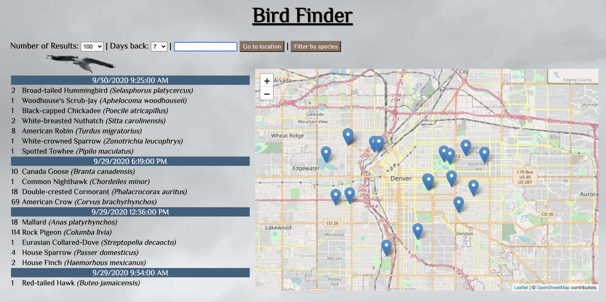

# Bird Finder

This was a project to map recent bird sightings from
[eBird](https://ebird.org). As a Wildlife Biologist for the past 
nine years, I have come across many amateur ornithologist in the field. 
A common question I received was "Where may I find ${bird} (species of interest)?".
I would refer them to areas that I knew and told them that there was 
a good amount of information online as to the location of known 
bird sightings.  However, many of these resources are confusing to use and 
do not provide the instantaneous answer people are looking for.  This being the case, 
I decided to create this app.  With this app you will be able to view on a 
map the location of recent bird sightings based on  a given geographic location.  
The maps are generated using [leaflet](http://leafletjs.com/) and
[openstreetmap](https://openstreetmap.org) data. To obtain recent bird sighting 
data I used the [eBird-API](https://documenter.getpostman.com/view/664302/S1ENwy59?version=latest).

There are at least two downsides too using this data. The first,
due to the demographics of most birdwatchers, is that reported locations are
typically those easily accessible by vehicle, not necessarily those that have
the most interesting sightings.

The second is the risk of making a mistaken identification on the basis of
expecting to see a species because others have reported seeing it in the area.

To view a demonstration of this app please click on the link below.

[Bird-Finder](https://youtu.be/3k4Qu5QGGA0)

Please feel free to [e-mail](mailto:jcfernan@live.com) me if you have any question about this project.
